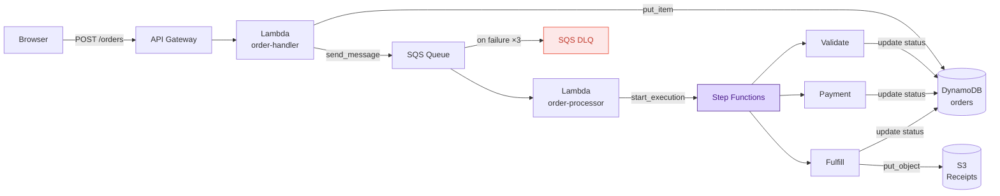

# LocalStack Workshop

Hands-on workshop: local serverless development with [LocalStack](https://localstack.cloud).

**Duration:** ~3 hours  
**Level:** Intermediate  
**Prerequisites:** Docker, Python 3.10+, VS Code (for module 03)

---

## What You'll Build

An **Order Processing Pipeline** — a realistic event-driven serverless app with a live web UI, Step Functions orchestration, chaos engineering, and full local AWS emulation via LocalStack.



The UI is served from S3 and shows live order status, pipeline progress, and step-level timestamps. Everything runs **locally** via LocalStack — no AWS account needed.

---

## Modules

| # | Module | Topics | Time |
|---|--------|--------|------|
| [00](./00-setup/) | Setup | Install tools, start LocalStack, verify | 15m |
| [01](./01-serverless-app/) | Serverless App | Deploy with Terraform, explore the UI | 45m |
| [02](./02-e2e-testing/) | E2E Testing | pytest integration tests against LocalStack | 30m |
| [03](./03-vscode-debugging/) | Lambda Debugging | VS Code AWS Toolkit breakpoints | 30m |
| [04](./04-chaos-engineering/) | Chaos Engineering | DDB fault injection, DLQ, retries | 30m |
| [05](./05-app-inspector/) | App Inspector | Trace requests, visualize service topology | 20m |
| [06](./06-ai-integration/) | AI Integration *(optional)* | LocalStack MCP + Claude Code skills | 10m |

---

## Quick Start (GitHub Codespaces)

[](https://codespaces.new/localstack/localstack-workshop)

The dev container pre-installs all tools and starts LocalStack automatically. Then deploy the app:

```bash
make deploy
make open-ui
```

## Quick Start (Local)

```bash
# 1. Install dependencies
pip install localstack awscli-local terraform-local pytest

# 2. Start LocalStack
localstack start -d

# 3. Run setup (configures auth token + AWS profile)
./00-setup/setup.sh

# 4. Deploy the app
make deploy
make open-ui
```

---

## Repo Layout

```
localstack-workshop/
├── 00-setup/              # environment setup & auth token configuration
├── 01-serverless-app/     # core app — shared by all modules
│   ├── lambdas/
│   │   ├── order_handler/     # API handler: GET/POST /orders, GET /products
│   │   └── order_processor/   # SQS consumer + Step Functions steps
│   ├── terraform/             # infrastructure as code
│   └── website/               # S3-hosted UI (HTML/JS, no build step)
├── 02-e2e-testing/        # pytest test suite
├── 03-vscode-debugging/   # VS Code launch configs + instructions
├── 04-chaos-engineering/  # fault injection scripts & DLQ replay
├── 05-app-inspector/      # App Inspector walkthrough
├── 06-ai-integration/     # MCP server + LocalStack skills demo
└── old/                   # archived EuroPython 2023 workshop materials
```

All modules build on the single app deployed in `01-serverless-app/`.

---

## Makefile Targets

```
make setup          # Fetch auth token and start LocalStack
make deploy         # Deploy the full app via Terraform
make redeploy       # Tear down and redeploy from scratch
make open-ui        # Open the orders UI in the browser
make test           # Run E2E integration tests
make inject-fault   # Inject DynamoDB throttling fault (chaos demo)
make remove-fault   # Remove all active fault injections
make replay-dlq     # Replay messages from the DLQ
make logs           # Tail LocalStack logs
```
